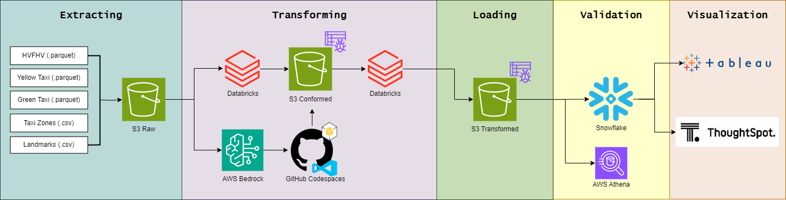

# ETL Pipeline

### Architecture Diagram

### Extract
During this phase of our data pipeline, we extracted the raw data files from Amazon S3 and opened them in instances of Databricks and GitHub Codespaces. We extracted the data in Databricks by using Spark's .conf method to load our AWS credentials. In GitHub Codespaces, we used a boto3 client to download data directly from S3.
### Transform
In order to transform the data, we performed a variety of transformations to enrich and clean our data. These actions include dropping duplicates, filling in null values, filtering our data based on our outlier requirements, and changing column names in our dataframes. We also added more datetime columns such as year, month, and day to enrich each dataset. For our external dataset, Amazon Bedrock was used to append a column to our external landmark data, which contains the record's landmark category.
### Load
We loaded the transformed data in S3 using different instances of Databricks: one for our trip data and one for the landmark data. For the trip data, we partitioned the trip data by year, month, and day in order to better organize our data in S3. Since the external landmark dataset was small, we were able to use .write to upload it directly to S3. All of the transformed data was eventually validated in AWS Athena before loading it into Snowflake as tables.
