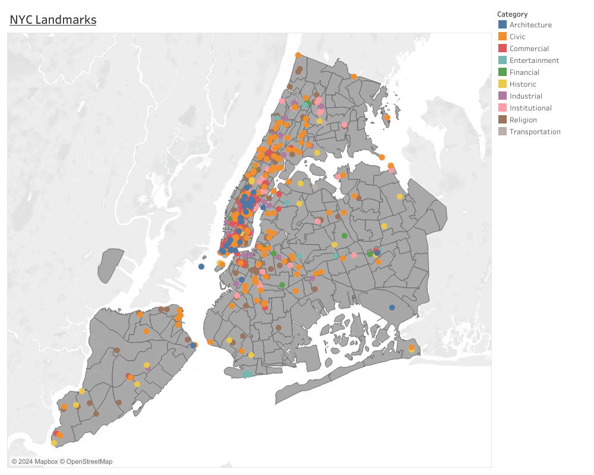
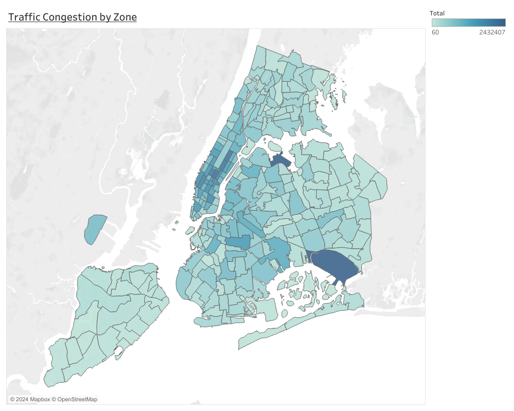
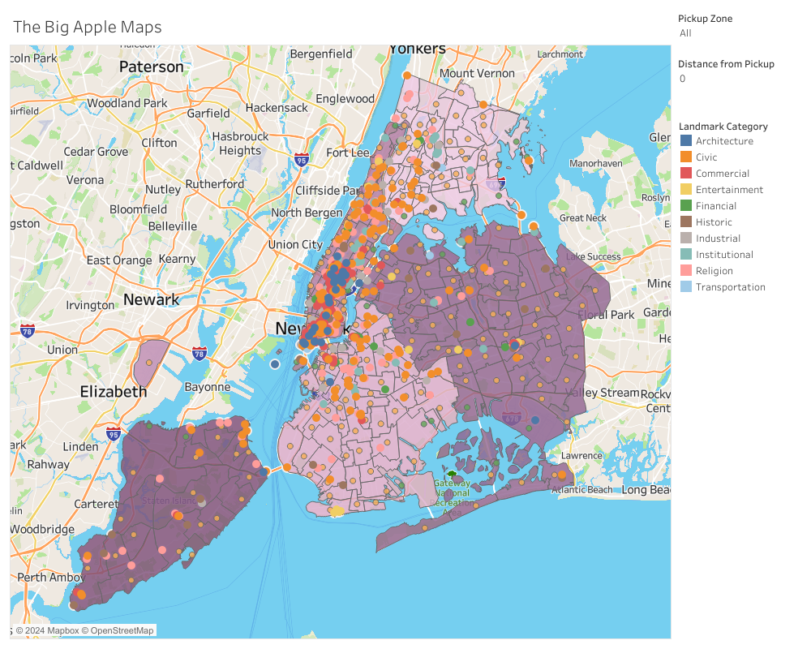
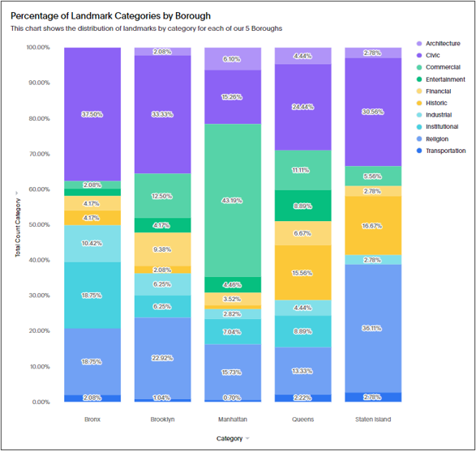
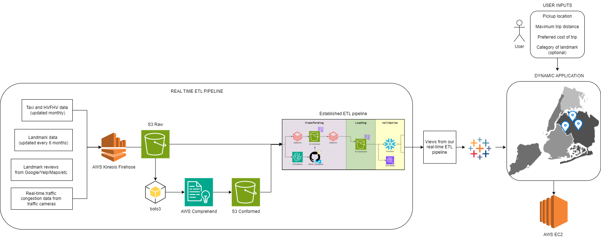

# Visualizations

## Tableau
#### Process
For the Tableau visualizations we created 3 maps to visualize the data aggreagation of both the taxi zones and the landmarks. We utilized geospatial data from the borough shapefiles to map it accurately on Tableau.

The first map we created was just a general outline of where the boroughs and taxi zones were located. This visualization also includes the landmarks mapped out on this layer. With this visualization we were able to see the landmark denisty within the boroughs, with Manhattan being the borough having the most landmarks.


The second map was a visualization to display the traffic congestion of the taxi zones. This was based on the sum of the taxi and high volume for hire vehicles rides for each zones _(query provided below)_. Based on this visualization you are able to see that Manhattan is the borough with the most traffic congestion because the taxi zones are more darker compared to the zones in the other boroughs. In relation to the first visualization you'll notice there is a positve correlation between traffic congestion and landmark density. The main example being Manhattan having a larger landmark density and traffic congestion in both scenarios. We also noticed that there were 2 taxi zones that had a high traffic congestion and were outside of the Manhattan borough. These zones were JFK Airport and LaGuardia Airport which makes sense because these zones are airport zones and there are a lot of people traveling to and from this zone using taxis and high volume for hire vehicles.


```
--taxi and HVFHV totals per zone
SELECT T.DO_ZONE, C + D as Total FROM 
(SELECT COUNT(DO_LOCATIONID) AS C, DO_ZONE
FROM CAPSTONE_DE.GROUP_1.TAXI
GROUP BY DO_ZONE) AS T JOIN 

(SELECT COUNT(DO_LOCATIONID) as D, DO_ZONE
FROM CAPSTONE_DE.GROUP_1.HVFHV
GROUP BY DO_ZONE) AS H ON T.DO_ZONE = H.DO_ZONE;
```

Our third map was the interactive map dashboard. This dashboard would be used by customers for them to determine which landmarks they want to visit based on their travel needs. They can choose how far they would want to travel and see the landmarks within their set distance. Plus they can filter through the landmark categories they want to see. 
Using this tool, customers would first select what taxi zone they are in, and the dashboard will zoom into the borough the taxi zone is in with the zone highlighted. Next, the customer would use the slider parameter and input how far they would want to travel from their current zone. This parameter starts at 0 miles and goes up to a 25 mile radius. Once this information is inputted, the customer will be able to see the buffer zone from their current location and see the landmarks that are in this buffer. The customer can then filter on what landmark category they want to see or just hover over the landmark points within the buffer to decide on where they would want to visit.



## ThoughtSpot

#### Description
We decided to utilize ThoughtSpot's AI capabilities to help us visualize our landmark data using a liveboard. By incorporating multiple visualization tools into this project, our findings can appeal to more data and business teams. The dashboard below showcases the distributions of landmarks in each borough as percentages. From this data, we were able to make the following conclusions:

#### Percentage Leaders
Each borough was a percentage leader in at least one category:

| Borough | Category(s) |
|--------------|----------------------------|
| Bronx | Civic, Industrial, Institutional |
| Brooklyn | Financial |
| Manhattan | Architecture, Commercial | 
| Queens | Entertainment | 
| Staten Island | Historic, Religion, Transportation  | 

#### Key Takeaways
If you are a tourist looking to see a specific type of landmark, we recommend visiting the corresponding percent leader for that landmark. This is the best course of action because by dividing up tourists into the different boroughs, we can alleviate traffic congestion in Manhattan. If a tourist doesn't have a preference for what landmarks they see, the dashboard indicates that Queens and Brooklyn have the most even distribution of landmarks. Therefore, we recommend these boroughs if tourists want a nice variety of landmarks.

#### Our Landmark Distribution Dashoard


Query Used to Generate Visual: ```count Category by Borough for each Category```

## Future Solution
Our goal for this final visualization is to create a customer friendly application of this dashboard so that this map and its filters would be highly accessible and customers would be able to use this tool while they are traveling to get real time information. We would also be implementing other filter factors so that customer would be able to make more informed decisions. This would include travel cost filters for taxi and high volume for hire vehicles, real time traffic data from traffic cameras, and landmark reviews data from Google and Yelp. This data, along with our previous data, would be fully managed and streamed using Amazon Data Firehose and delivered to our S3 bucket. We also plan on taking the landmark review dataset and run it through AWS Comprehend for sentiment analysis and create a score based on good reviews or bad reviews. From here our data will be going through the established ETL pipeline from before in order to create transformations and for validating the data.


